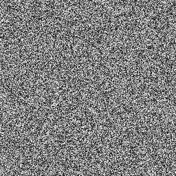
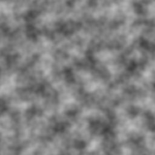

# cl-noise
Noise generation library for Common Lisp

## Structures

- `noise-desc`: Descriptor struct for parameters of a noise generator.
The fields of the descriptor are enumerated below:

  - `generator`: The noise generator function. The only required argument must
  be a list of coordinate components in the first position (a "point"). The coordinates should
  be in row-major order. Additional arguments may be passed as `&key` parameters
  but must have defaults.
  
  - `generator-keys`: A property list of arguments to pass to `gen`,
  in addition to the coordinate list. This is where `&key` parameters may be passed to `gen`.

  - `size`: The size of noise to generate when used in `make-generator`, `make-buf`, etc.
  For 1-dimensional noise, an integer. Otherwise, a list of integer dimension sizes in
  row-major order.
  
  - `octaves`: The amount of octaves of noise to consider.
  
  - `persistence`: The weight of each octave, relative to the last.
  
  - `frequency-scale`: Dimension scaling amount for each successive octave. May be a single number
  for uniform scaling, or a list of number to scale the corresponding entry in `size`.
  
  - `offset`: The offset of the first data point of noise from the origin.

  - `width`: The width of the sampled noise; e.g. a value of `2` will sample
  in the range [`offset`, `offset`+2).

## Functions

```
noise point desc
```

Take a point `point` and a generator descriptor `desc` and return
the value of the noise at `point`.

```
make-generator desc
```

Take a generator descriptor `desc` and return a closure that returns each data
point of noise described by `desc` in row-major order.

```
make-buffer desc
```

Take a generator descriptor `desc` and return a buffer that contains the noise
described by `desc`.


```
uniform-perm n
```

Generate a random uniform permutation in the range [0,n) using
the [Fisher-Yates Shuffle](https://en.wikipedia.org/wiki/Fisher%E2%80%93Yates_shuffle).

## Macros

```
with-generator name desc &body body
```

Execute the body `body` with the noise generator function described by `desc` bound to `name`.

```
with-buffer name desc &body body
```

Execute the body `body` with the noise generator buffer described by `desc` bound to `name`.

## Builtin Generators
Noise generators are defined in `cl-noise.gen.GENERATOR` and reexported in `cl-noise.gen`.
All noise generators output values in the range [-1, 1]

```
uniform &rest unused
```

Uniform random noise.

---

```
perlin point &key (perm +ken-perlin-perm+)
```

[Perlin noise](https://en.wikipedia.org/wiki/Perlin_noise).

Takes a point `point` and a uniform permutation of integers [0-255] and returns the value of
perlin noise at `point`.

Uses original
[Ken Perlin Permutation](https://en.wikipedia.org/wiki/Perlin_noise#Permutation)
by default.

---

```
simplex point &key (perm +ken-perlin-perm+)
```

[Simplex noise](https://en.wikipedia.org/wiki/Simplex_noise).

Takes a point `point` and a uniform permutation of integers [0-255] and returns the value of
simplex noise at `point`.

Uses original
[Ken Perlin Permutation](https://en.wikipedia.org/wiki/Perlin_noise#Permutation)
by default.

## Examples

To build examples:

```console
$ ./build.sh $EXAMPLE
$ ./build.sh png       # build png example
```

### png
Create a PNG of 2 dimensional noise.

```
Usage: png OPTIONS FILE [FILE ...]
Available options:
  -h, --help                Print this help text
  -s, --size ROWS,COLUMNS
                            The size of the noise as a comma-separated list in row-major order [Default: (3 3)]
  -o, --octaves ARG         Number of octaves to use for perlin noise [Default: 1]
  -p, --persistence ARG     Weight of each octave relative to the last [Default: 0.5]
  -w, --sample-width ARG    Noise sample size [Default: 8.0]
  -g, --generator ARG       Specifies the noise generation function
                            One of [`UNIFORM', `PERLIN', `SIMPLEX'] [Default: perlin]
  -k, --ken-perlin-perm     Whether to use Ken Perlins original permutation
  --offset Y[,X]            Offset of first noise data point from origin [Default: (0 0)]
```

- 256x256 uniform noise to "image.png":

```console
$ ./png -g uniform --size 256,256 "image.png"
```



- 256x256 perlin grayscale, 3 octaves to "image.png":

```console
$ ./png -g perlin --size 256,256 --octaves 3 "image.png"
```



### text
Output 1 or 2 dimensional noise as text to standard out.

```
Usage: text OPTIONS [FILE ...]
Available options:
  -h, --help                Print this help text
  -s, --size ROWS[,COLUMNS] The size of the noise as a comma-separated list in row-major order
                            [Default: (3 3)]
  -o, --octaves ARG         Number of octaves to use for perlin noise [Default: 1]
  -p, --persistence ARG     Weight of each octave relative to the last [Default: 0.5]
  -w, --sample-width ARG    Noise sample size [Default: 8.0]
  -g, --generator ARG       Specifies the noise generation function
                            One of [`UNIFORM', `PERLIN', `SIMPLEX'] [Default: perlin]
  -k, --ken-perlin-perm     Whether to use Ken Perlins original permutation
  --offset Y[,X]            Offset of first noise data point from origin [Default: (0 0)]
```

- 4 values of uniform noise:

```console
$ ./text --size 4 -g uniform
```

```
0.7695440824515019 -0.7537826533967542 0.6109767621066111 0.4594674938062311
```

- 4x4 values of simplex noise offset to (5,5) using the Ken Perlin permutation:

```console
$ ./text --size 4,4 --offset 5,5 -g simplex -k | column -t
```

```
0.33723438   0.6889363        0.2889931    0.6488647
0.49733528   0.2889949        -0.3244326   -0.6220379
0.5779881    0.0000005150496  0.49821177   0.07493882
-0.32443157  -0.4982115       -0.03746941  -0.13081408
```
