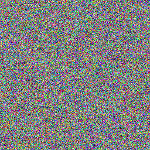
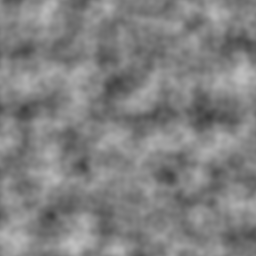

# noise
Noise generators written in Common Lisp

## Requirements
- SBCL

## Cloning and building

```console
$ git clone https://github.com/jakergrossman/noise.git
$ cd noise
$ ./build.sh
```

## Running
```
Usage: noise [-h] [--size SIZE] [--output-file OUTPUT]
             [--generator GENERATOR] [--color-type COLOR-TYPE]
             [--octaves OCTAVES] [--persistence PERSISTENCE]

Available options:
  -h, --help            Print this help text
  -s, --size ARG        The side length of the generated image
  -o, --output-file ARG Name of the output PNG file [Default: output.png]
  -g, --generator ARG   Which generator to use to generate noise
                        One of [`UNIFORM', `PERLIN'] [Default: UNIFORM]
  -c, --color-type ARG  The color type to use
                        One of [`GRAYSCALE', `TRUECOLOR'] [Default: GRAYSCALE]
  --octaves ARG         Number of octaves to use for perlin noise
  --persistence ARG     Weight of each perlin octave relative to the last
```

## Examples

- 256x256 uniform truecolor to "image.png":

```console
$ ./noise -s 256 -c truecolor -o "image.png"
```



- 256x256 perlin grayscale, 3 octaves to "image.png":

```console
$ ./noise -s 256 -g perlin --octaves 3 -o "image.png"
```


